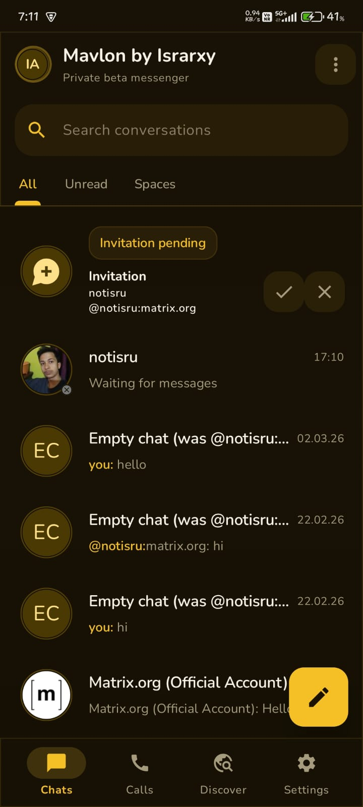

# Mavlon

**Mavlon by Israrxy** is a private beta Matrix messenger for Android with a custom Material 3 interface, in-app web flows, app lock, appearance controls, and early native calling support.

## Current Release

- Version: `0.1.0-beta1`
- Android: `9.0+ (API 28+)`
- Status: `Private beta`

## Screenshots

### Home

### Chat

## Features

- Modern Matrix messaging experience
- Custom Mavlon home screen and conversation UI
- In-app web links using Chrome Custom Tabs
- 4-digit PIN app lock
- Typing indicators
- Appearance customization
  - global chat colors/background styling
  - per-chat appearance overrides
- Early native calling support with a separate call screen
- Call logs
- Background update checking
- UnifiedPush notification support

## What This Beta Focuses On

This build is focused on:

- fast day-to-day messaging
- a cleaner custom Android UI
- privacy-friendly app access with PIN lock
- release distribution and update flow testing

## Important Beta Notes

- Video calling is currently disabled in this build
- Calling is still in active refinement
- Some areas are still being polished for performance and consistency

## Download

Use the latest release from this repository’s Releases page.

If a newer stable version is published, the app can prompt for an in-app update automatically.

## About

Mavlon is designed and developed by **Israrxy**.
